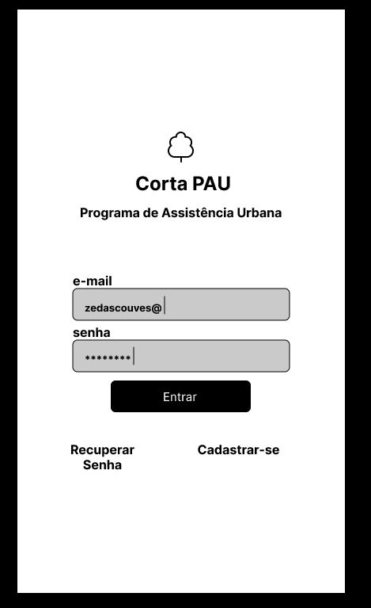

# Corta Pau

Trabalho de Hands on Work 10 realizado no curso de Análise e Desenvolvimento de Sistemas da UNIVALI


Install [docker compose](https://docs.docker.com/compose/install/).


Clonar o repositório:

```
git clone https://github.com/ThaissaCaino/cortapau.git
cd cortapau
```

Intanciando aplicaçõa
```sh
docker-compose up -d
```
Ou

```sh
docker-compose -f docker-compose-consumer.yml up
```

Depois de inicializado estará disponivel em :

- http://localhost:80

 

